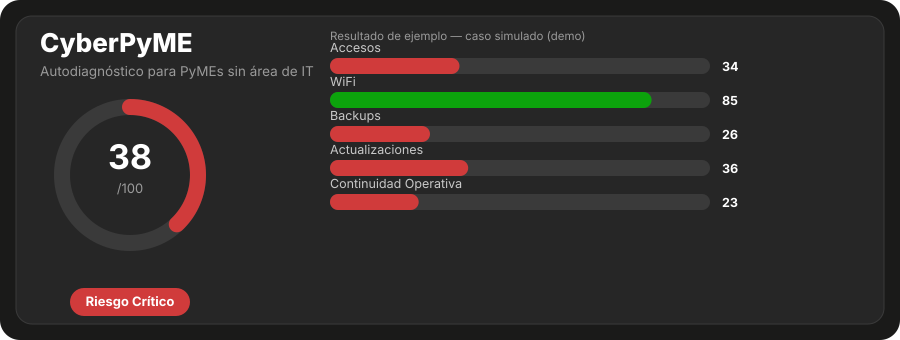

<p align="center">
  
</p>

<h1 align="center">CyberPyME</h1>
<p align="center"><strong>Autodiagnóstico de ciberseguridad para PyMEs sin área de IT</strong></p>

<p align="center">
  
  
  
  
  
</p>

---

Una PyME sin área de IT no necesita un SOC ni una auditoría de $10.000 dólares
para saber si está expuesta. Necesita saber **qué protege, qué puede
perder, y cuáles son las primeras cinco acciones que reducen más riesgo**.

CyberPyME traduce controles de seguridad de nivel profesional (NIST CSF 2.0 +
CIS Controls v8.1 IG1) a **24 preguntas en criollo**, calcula una postura de
riesgo por dominio y global, y devuelve un plan de acción priorizado — con
guía paso a paso para resolver cada brecha, no solo para detectarla.

## 🚀 Probalo ahora — sin instalar nada

La forma más rápida de ver esto andando es la **app interactiva**: un único
archivo `.html` que corre 100% en tu navegador (sin backend, sin conexión,
sin que nada de lo que respondas salga de tu PC).

```bash
cd backend
python -m app.cli app --html cyberpyme_app.html
```

Abrí `cyberpyme_app.html` con doble clic. Respondés el cuestionario (~5
minutos) y obtenés tu score, tu nivel de riesgo y las acciones priorizadas
al instante, ahí mismo.

## 📐 Metodología

| Dominio | Peso | Qué mide | Preguntas |
|---|---|---|---|
| **Accesos** | 25% | Cuentas individuales, MFA, gestión de contraseñas, privilegios, phishing | 6 |
| **WiFi** | 15% | Cifrado de red, contraseña, administración del router, red de invitados | 4 |
| **Backups** | 25% | Copias automáticas, aislamiento frente a ransomware, estrategia 3-2-1, pruebas de restauración | 4 |
| **Actualizaciones** | 15% | Parcheo de SO/apps, inventario, antivirus, control de USB, cifrado de disco | 6 |
| **Continuidad Operativa** | 20% | Servicios críticos, plan ante incidentes, recuperación, pruebas anuales | 4 |

Cada pregunta responde con una escala de 4 valores (`Sí` = 1.0, `Parcial` =
0.5, `No` / `No sé` = 0.0) y tiene peso propio, mapeo a **NIST CSF 2.0** y
**CIS Controls v8.1 IG1**, y una recomendación asociada con guía de
resolución paso a paso.

```
score_dominio = 100 × Σ(peso_i × respuesta_i) / Σ(peso_i)
score_global  = Σ(score_dominio_j × peso_dominio_j) / Σ(peso_dominio_j)

Riesgo:  ≥80 BAJO  ·  ≥60 MEDIO  ·  ≥40 ALTO  ·  <40 CRÍTICO
```

El cuestionario fue auditado dos veces (2026-09-03) contra el catálogo
completo de CIS Controls v8.1 IG1 (los 15 controles aplicables a una PyME
sin IT) y NIST CSF 2.0 (sus 6 funciones), para asegurar que no faltara
cobertura de ningún control de nivel esencial.

## 🧩 Qué hay en el repo

Cinco formas distintas de usar el mismo motor de scoring — todas
deterministas, todas generadas a partir de los mismos `questions.json` /
`recommendations.json`, ninguna con backend:

| Comando | Qué genera |
|---|---|
| `python -m app.cli app --html app.html` | **La app** — cuestionario + resultado, todo en el navegador |
| `python -m app.cli demo` | Demo de consola con un caso simulado (PyME de 12 empleados) |
| `python -m app.cli interactivo` | Demo de consola respondiendo pregunta por pregunta |
| `python -m app.cli validacion --html comparativa.html` | Valida el motor con 3 perfiles (débil/medio/maduro) y compara resultados |
| `python -m app.cli hardening --html guia.html` | Catálogo completo de hardening, agrupado por dominio — no depende de ningún diagnóstico puntual |

Agregá `--html <archivo>` a `demo` o `interactivo` para generar también el
informe interactivo de esa evaluación puntual.

## 🗂️ Estructura

```
cyberpyme/
├── CLAUDE.md                    # contexto de estado del proyecto (siempre al día)
├── BITACORA-INTERNA.md          # bitácora real de avance (staging antes de publicar en Notion)
├── docs/
│   └── preview.svg
└── backend/
    ├── app/
    │   ├── data/
    │   │   ├── questions.json          # 24 preguntas, 5 dominios, mapeo NIST/CIS
    │   │   ├── recommendations.json    # catálogo de recomendaciones (why + steps)
    │   │   └── validation_cases.json   # 3 perfiles simulados (débil/medio/maduro)
    │   ├── models/
    │   │   ├── question.py             # Question, Answer
    │   │   └── assessment.py           # DomainResult, AssessmentResult
    │   ├── services/
    │   │   ├── scoring.py              # motor de scoring determinista
    │   │   ├── validation.py           # corre y valida los 3 casos simulados
    │   │   ├── report.py               # informe / comparativa / guía de hardening (HTML)
    │   │   └── interactive_app.py      # la app — motor portado a JS, todo en el navegador
    │   └── cli.py
    └── tests/                          # 25 tests, pytest
```

## ⚙️ Principios de diseño

- **Determinismo.** Misma respuesta → mismo score, siempre. Sin llamadas
  externas ni aleatoriedad en el scoring.
- **Configuración sobre código.** Preguntas, pesos, recomendaciones y guías
  de resolución viven en JSON. Agregar una pregunta no toca el motor.
- **Cero infraestructura.** Todo el flujo — cuestionario, scoring, informe —
  corre sin backend, sin base de datos, sin build step. Un archivo `.html`
  es la unidad de distribución.
- **Trazabilidad.** Cada recomendación se puede rastrear a la pregunta que
  la generó, y cada pregunta a su control NIST/CIS específico.
- **KISS/YAGNI.** No se anticipa infraestructura de producto (API, DB,
  auth) dentro del alcance académico — eso tiene su propia fase, más
  adelante.

## ✅ Correr los tests

```bash
cd backend
pip install pytest --break-system-packages   # única dependencia
python -m pytest tests/ -v                    # 25 tests
```

## 🗺️ Estado del proyecto

**Entrega académica** (obligatoria, vence 13/dic/2026) — ✅ motor de
scoring · ✅ informe interactivo · ✅ validación con 3 casos · ✅ guía de
hardening · ✅ app interactiva · ⏳ documentación final + manual de uso
(recién arranca más cerca de la fecha, a propósito — el proyecto todavía
va a cambiar bastante).

**Fase producto** (sin fecha límite académica, después del 13/dic) — API
FastAPI sobre este mismo motor ya validado, Supabase con RLS real,
frontend Next.js, multiempresa. Todavía no arrancada, deliberadamente.

## 🎓 Contexto académico

Este proyecto es el entregable de la **Práctica Profesionalizante** de la
Tecnicatura Superior en Seguridad Informática — **TECLAB**, período 2A
2026 (18/ago – 13/dic/2026), con intención de convertirlo después en un
producto real.

---

<p align="center"><sub>CyberPyME no reemplaza una auditoría profesional — es un primer nivel de diagnóstico, priorización y concientización para organizaciones con recursos técnicos limitados.</sub></p>
